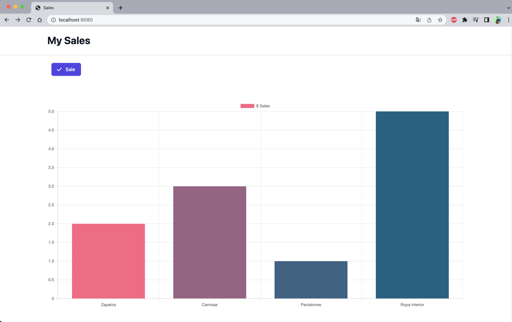

## Project Web Socket with JavaScript

Application with Web Sockets that show charts in real time.




### Dependencies 

- [websocket](https://www.npmjs.com/package/websocket/v/1.0.34)
- [http-server](https://www.npmjs.com/package/http-server/v/14.1.1)


### How to run

1. You must to install `http-server` how global dependencie
```bash
  npm install -g http-server
```
2. In the **/server** folder you must install dependencies of the `package.json`
```bash
  npm install
```
3. Now to run the server is necessary to open a new terminal in the path of server folder and to execute:
```bash
  npm start
```
4. Then you need to run in other terminal `http-server -p 8080`
5. You can visiting in browser to `http://localhost:8080`
